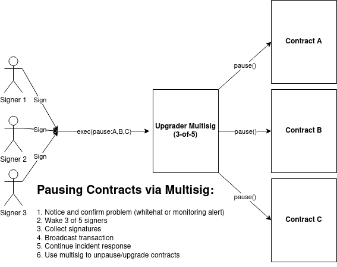
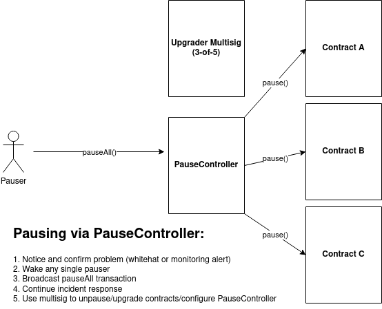

## sol-pause

**This library has not been audited, tested, or even finished.**

`sol-pause` makes it easy to implement a catch-all "panic button" for use during incident response.

You should use something like `sol-pause` if: 
* you intend to have pausable contracts in production
* you want to the option to remove the "pausability" of your contracts once you feel more confident
* you're not sure how to configure "pausability" alongside the other roles/permissions your system has
* you want a solution to all of this that doesn't add much complexity

#### Why Do I want this?

When building complex, multi-contract systems, it's pretty common to include some form of admin control to safeguard the protocol. This role can typically tweak protocol parameters or perform contract upgrades, which can be very useful as a way to recover a system when a bug is discovered. However, these setups are NOT optimal to respond to on-chain incidents!

Because "upgradability" is a security-critical feature, it's often placed in control of a high-threshold multisig. This means that triggering any functions this role holds tends to be very slow. Here's a typical "pause all the contracts" flow for multisig-based setups:

#### What's the problem?

The time between confirming there's a problem and pausing all the contracts can be very high because of the number of people that need to coordinate to execute a transaction. If a pause needs to happen while multiple signers are asleep, they may not be reachable for hours. This is a good thing in the context of contract upgrades - these should be slow and difficult to trigger.

BUT: incidents can happen in minutes, not hours. By the time you manage to get your signers together, it may be too late. And if your attacker is smart, they'll do their research and wait until you're most likely to be asleep.

#### What's the fix?

`sol-pause` separates "pausing" from the other roles of an upgrader multisig, enabling pauses to be triggered by just one person (a "Pauser") rather than requiring multiple signers. Any number of Pausers can be added to the `PauseController`, and when any one Pauser calls `PauseController.pauseAll()`, all of the contracts in the system are immediately paused. This setup is designed to give your contracts a very simple "panic button" - something that a single informed, trusted individual can quickly trigger to immediately halt all your contracts:

*A risk you're accepting by using a setup like this is that each Pauser is only secured by a single key, which could be lost of stolen.* To mitigate this risk, Pausers are restricted to a minimal role. The ONLY thing a Pauser can do is call `pauseAll()` - they have absolutely no other power. 

The `PauseController` owner (which can be your high threshold multisig) is required to do anything else:
* unpausing contracts
* adding/removing Pausers
* adding/removing Pausable contracts
* upgrading or burning the `PauseController`

The above access controls were designed with a handful of scenarios in mind:
* If a Pauser key is lost, it can easily be swapped out by the `PauseController` owner (see `setPauser`). As long as you have other Pausers, the other Pausers can still trigger a pause if needed.
* If a Pauser key is stolen, the worst case scenario is that an attacker is able to pause all your contracts. The `PauseController` owner will have to be used to revoke the Pauser's permissions and unpause the contracts (via `setPauser` and `unpauseAll`, respectively).
    * This is not a good situation to be in, but the situation is at least a known, testable worst-case - and you can prepare for it! Assuming you've covered ALL your user-facing methods with `whenNotPaused` modifiers, it shouldn't directly lead to fund loss. It's important that you don't leave user-facing methods open -- and carefully consider this risk when deciding whether you want `sol-pause` for your contracts.
* If you add new contracts to the system, the `PauseController` owner can easily add them to the list of contracts to be paused (see `addPausables`)
* If you want to change how the `PauseController` works, or remove it from the system entirely, the `PauseController` owner can use `migrateAll` to update the `PauseController` address in all your system's contracts at once.

Things `sol-pause` does NOT help with:
* *Proxy-level bugs*: Implementation-level pauses don't affect a proxy. Fortunately these aren't common, and can be planned for by having a pre-prepared contract upgrade ready for exactly this scenario.
* *Multisig compromise*: Pauser keys are designed to be lower security and swappable by a higher-security root of trust. If the root of trust (your multisig) is compromised, `sol-pause` can't fix that.
* *Giving Pausers additional access in the system*: Pauser keys should ONLY be used for pausing. If you grant Pauser addresses other permissions, the consequences of key loss/compromise could be worse.
* *Failing to cover ALL user-facing methods, or failing to register `Pausable` contracts in the `PauseController`*: self-explanatory.

#### Why pause, instead of upgrading as soon as we know there's a problem?

Contract upgrades are slow, methodical processes - for good reason. Upgrades require lots of time to think, examine the problem, and test the solution. If you get it wrong, there's a big risk you make things worse.

Knowing there's a problem is easy - you get a DM from samczsun and check etherscan. Knowing how to patch the problem is very hard. As such, contract upgrades should never be your first response to an active incident.

### How does it work?

Pausable contracts inherit from `src/Pausable.sol` and may be paused (or unpaused) by the `PauseController`. `Pausable.sol` is a minimal wrapper around OpenZeppelin's `PausableUpgradeable`, and works exactly the same way: when paused, any methods protected by the `whenNotPaused` modifier are locked, preventing access/state changes until unpaused.

The `PauseController` is intended to be deployed as a standalone contract (i.e. not behind a proxy) and is configured with a list of pausable contracts. 

The `PauseController` owner has access to the following methods:
* `PauseController.pauseAll()` calls `pause()` on each pausable contract
* `PauseController.unpauseAll()` calls `unpause()` on each pausable contract
* `PauseController.addPausables(address[])`: adds one or more pausable contracts to the controller
* `PauseController.removePausables(address[])`: removes one or more pausable contracts from the controller
* `PauseController.setPauser(address,bool)`: Adds/removes a Pauser from the controller
* `PauseController.migrateAll(address)`: Calls `updatePauseController` on each pausable contract

Pausers have access to the following method:
* `PauseController.pauseAll()`: iterates over the pausable contracts and calls `pause()` on each
